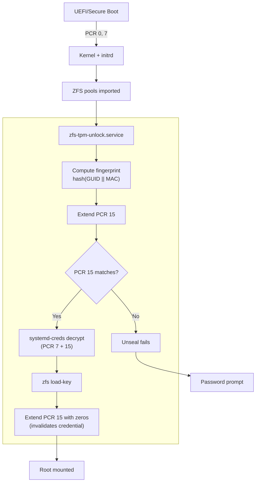

When you configure automatic disk unlock using a TPM2, you probably expect your
data to be protected from attackers with physical access to your machine. But
what if I told you that many common setups can be bypassed in under 10 minutes
with nothing more than a screwdriver and a live USB stick?

This is the story of how we designed a TPM2-based ZFS unlock mechanism for NixOS
that defends against three distinct attack vectors that plague existing
solutions like Clevis and basic systemd-cryptenroll setups.

## A Primer on TPM Platform Configuration Registers

Before diving into the vulnerabilities, let's understand how TPMs protect
secrets.

A Trusted Platform Module (TPM) is a dedicated security chip that can store
secrets and release them only when certain conditions are met. The key mechanism
is **Platform Configuration Registers (PCRs)** — a set of 24 special registers
that record measurements of your system's boot process.

### How PCRs Work

PCRs don't store values directly. Instead, they use a one-way extension
operation:

```
new_PCR_value = hash(old_PCR_value || new_data)
```

This means:

- Each PCR starts at zero (or all-0xFF for PCRs 17-22)
- Every measurement _extends_ the register, mixing new data with the old value
- You cannot "undo" an extension — the hash is one-way
- The final value represents the _entire chain_ of measurements

### PCR Assignments

The
[Linux TPM PCR Registry](https://uapi-group.org/specifications/specs/linux_tpm_pcr_registry/)
defines standard purposes:

| PCR | Name               | What It Measures                           |
| --- | ------------------ | ------------------------------------------ |
| 0   | platform-code      | Core firmware (UEFI)                       |
| 2   | external-code      | Option ROMs, external firmware             |
| 7   | secure-boot-policy | Secure Boot state, enrolled certificates   |
| 9   | kernel-initrd      | Kernel and initrd images (when using shim) |
| 15  | system-identity    | System identity — _more on this later_     |

> **Note**: This table only shows a few relevant PCRs. The full registry defines
> all 24 PCRs — see the complete specification for details.

When you seal a secret to the TPM, you specify which PCRs must match. If an
attacker modifies your bootloader, PCR 7 changes. If they swap your kernel, PCR
9 changes. The TPM refuses to unseal your disk key.

Sounds secure, right? Unfortunately, there are gaps.

## The Three Vulnerabilities

### 1. TPM Bus Sniffing (CVE-2026-0714)

**The problem**: Many TPM implementations communicate with the CPU over an
unprotected SPI or I2C bus. An attacker with physical access can tap this bus
and read secrets in transit.

This was dramatically demonstrated in
[CVE-2026-0714](https://www.cyloq.se/en/research/cve-2026-0714-tpm-sniffing-luks-keys-on-an-embedded-device),
where researchers extracted disk encryption keys from a Moxa industrial computer
by passively sniffing the TPM's SPI bus during boot. The `TPM2_NV_Read` command
returned the decryption key in plaintext — despite the TPM correctly enforcing
its PCR policy.

**Why Clevis is vulnerable**: Clevis does not use TPM encrypted sessions by
default. When it retrieves the sealed secret, the communication travels
unencrypted over the bus. An attacker with a logic analyzer connected to the TPM
can capture the key material directly.

**The solution**: Use TPM encrypted sessions. The TPM2 spec supports
authenticated and encrypted sessions that protect communication from bus-level
eavesdropping.

### 2. Root Volume Confusion Attack

**The problem**: Even with proper PCR binding, most setups fail to verify the
_identity_ of the encrypted volume before executing code from it.

This brilliant attack is described in detail by
[oddlama's blog post on bypassing disk encryption](https://oddlama.org/blog/bypassing-disk-encryption-with-tpm2-unlock/).
The attack works like this:

1. Attacker boots from live USB, backs up the header of your encrypted partition
2. Creates a new encrypted partition with the _same UUID_ and a password they
   control
3. Places a minimal Linux rootfs inside with a malicious `/sbin/init`
4. Reboots the machine normally
5. TPM unlock fails (wrong partition), initrd falls back to password prompt
6. Attacker enters their password — initrd mounts the fake root
7. Malicious init runs with TPM still in a valid state
8. Attacker's code requests the _real_ decryption key from the TPM — and gets
   it!

The fundamental issue: nothing in the boot chain verified that the encrypted
volume was _legitimate_ before handing over TPM access. The initrd checked that
the bootloader wasn't modified (via PCR 7), but not that the encrypted data came
from the right source.

**Why PCR 7 alone isn't enough**: PCR 7 measures Secure Boot state and
certificates — it proves the _code_ is authentic. But it says nothing about the
_data_ (your encrypted volumes). An attacker's fake volume doesn't change any
boot-time PCRs.

**The solution**: Extend PCR 15 with a fingerprint derived from each encrypted
volume _before_ unsealing. This binds the TPM secret to specific volumes, not
just boot code.

### 3. Post-Unlock Replay Attack

**The problem**: Once the disk is unlocked, the TPM credentials remain valid. An
attacker who gains root access could re-use them.

Consider this scenario:

1. System boots normally, disk unlocks via TPM
2. Attacker exploits a vulnerability and gains root
3. The credential file (`.cred`) is stored on disk — readable by root
4. Attacker decrypts the credential file using the TPM
5. They now have your disk encryption passphrase

While the actual key exists somewhere in kernel memory, modern Linux kernels
have extensive protections making direct memory extraction difficult:

- **KASLR** (Kernel Address Space Layout Randomization) randomizes where kernel
  code and data live
- **KPTI** (Kernel Page Table Isolation) separates kernel and userspace page
  tables
- **CONFIG_HARDENED_USERCOPY** prevents copying kernel objects to userspace
- **/dev/mem and /dev/kmem restrictions** block direct physical memory access
- **lockdown mode** (when enabled) further restricts kernel introspection

Decrypting the credential file is _much_ easier than kernel memory extraction.

**The solution**: Extend PCR 15 with a fixed value _after_ successful unlock.
This invalidates the credential — even if an attacker gets root, the TPM will
refuse to unseal because PCR 15 no longer matches the enrollment state.

## Our Implementation

Our NixOS systems use ZFS native encryption rather than LUKS. This choice has
its merits — ZFS encryption integrates with snapshots, replication, and the
copy-on-write model — but it also means we can't simply use existing tooling
designed for LUKS.

### The Challenge: ZFS + Encrypted Sessions

We wanted:

- TPM encrypted sessions (defense against bus sniffing)
- Custom PCR binding with pre-computed values (defense against volume confusion)
- Post-unlock PCR extension (defense against replay)

`systemd-cryptenroll` provides encrypted sessions and addresses the bus sniffing
problem, but it only works with LUKS volumes — not ZFS native encryption.

`systemd-creds` shares the same TPM infrastructure (including encrypted
sessions!) but has a critical limitation: it
[cannot seal against expected PCR values](https://github.com/systemd/systemd/issues/38763)
— only current ones. This means you'd need to be booted into the exact PCR state
you want to seal against, making pre-enrollment impossible.

### Enter mkcreds

This limitation led to the creation of
[mkcreds](https://github.com/codgician/mkcreds) — a Rust tool (vibe-coded with
Claude) that creates systemd-creds compatible credentials with one key addition:
**support for expected PCR values**.

```bash
# Seal with EXPECTED PCR 15 value (computed beforehand)
echo "secret" | mkcreds --tpm2-pcrs="7+15:sha256=<expected-hex>" - mycred.cred

# Later, decrypt normally with systemd-creds
systemd-creds decrypt mycred.cred -
```

This allows us to compute what PCR 15 _will be_ after extending with ZFS
fingerprints, and seal credentials against that future state — all without
rebooting.

### The ZFS Fingerprint: Proving Volume Authenticity

To defend against volume confusion, we need a value that:

1. Uniquely identifies each encrypted ZFS dataset
2. Cannot be forged without knowing the encryption key

We derive a fingerprint from ZFS's internal encryption metadata:

```bash
fingerprint = hash(GUID || MAC)
```

Where:

- **GUID** (`DSL_CRYPTO_GUID`): A unique identifier for the encryption root
- **MAC** (`DSL_CRYPTO_MAC`): The AES-GCM authentication tag from the key
  encryption

The MAC is particularly important. AES-GCM produces an authentication tag that
depends on both the plaintext (the key) and the encryption operation. Without
knowing the actual encryption key, an attacker cannot produce a valid MAC. They
could create a ZFS pool with the same GUID, but the MAC would be different.

The fingerprint computation uses `zdb` to extract these values directly from ZFS
metadata:

```bash
# Simplified version of our zfs-fingerprint script
crypto_obj=$(zdb -ddddd "$pool" "$root_ds" | grep -oP 'crypto_key_obj = \K\d+')
guid=$(zdb -ddddd "$pool" "$crypto_obj" | grep -oP 'DSL_CRYPTO_GUID = \K\d+')
mac=$(zdb -ddddd "$pool" "$crypto_obj" | grep -oP 'DSL_CRYPTO_MAC = \K[0-9a-f]+')
echo -n "${guid}${mac}" | sha256sum | cut -d' ' -f1
```

### The Unlock Flow

Here's how our `zfs-unlock` module orchestrates the secure unlock:



### NixOS Integration

The module is configured declaratively:

```nix
{
  codgician.system.zfs-unlock = {
    enable = true;
    devices = {
      "zroot" = {
        credentialFile = ./secrets/zroot.cred;
      };
      "zdata/encrypted" = {
        credentialFile = ./secrets/zdata-encrypted.cred;
      };
    };
  };
}
```

The `mkzfscreds` app handles enrollment:

```bash
# Compute expected PCR 15 and create credential
nix run .#mkzfscreds -- zroot > hosts/myhost/zroot.cred

# Output:
# Creating credential for: zroot (host: myhost)
# Devices: zroot
# Computing expected PCR 15...
#   zroot: a3b2c1d0...
# Expected PCR 15: 7f8e9d0c...
# Enter passphrase for zroot:
```

The tool automatically:

1. Reads all configured devices for the current host
2. Computes fingerprints for each device (in sorted order for determinism)
3. Simulates PCR 15 extension to get the expected value
4. Seals the credential against PCRs 1, 2, 7, 12, 14, and the computed 15

## Defense in Depth

No single mechanism is foolproof. Our approach layers multiple defenses:

| Attack Vector              | Defense                                |
| -------------------------- | -------------------------------------- |
| TPM bus sniffing           | Encrypted sessions (via systemd-creds) |
| Volume confusion           | Pre-unlock fingerprint → PCR 15        |
| Root credential replay     | Post-unlock zeros → PCR 15             |
| Bootloader tampering       | PCR 7 (Secure Boot policy)             |
| Kernel/initrd modification | PCR 9 (if using shim) or PCR 7 (UKI)   |

Even if one layer is bypassed, others remain. An attacker would need to:

1. Defeat bus encryption (requires sophisticated hardware attack)
2. Forge ZFS metadata (requires knowing encryption key)
3. Extract key before anti-replay extension (requires kernel exploit during
   small time window)

## Conclusion

TPM-based disk unlock sounds simple — seal a key to PCRs, unseal at boot. But
the details matter enormously:

- **Encrypted sessions** protect against physical bus sniffing
- **Volume identity verification** prevents filesystem confusion attacks
- **Post-unlock invalidation** limits the window for credential replay

The existing ecosystem has gaps. Clevis doesn't use encrypted sessions. Most
systemd-cryptenroll guides skip PCR 15 verification. Neither addresses ZFS
native encryption well.

Our solution — combining `mkcreds` for credential creation, ZFS fingerprints for
volume identity, and careful PCR 15 management — provides defense-in-depth for
NixOS systems with ZFS encryption.

The full implementation lives in our
[serenitea-pot](https://github.com/codgician/serenitea-pot) NixOS configuration,
specifically in `modules/nixos/system/zfs-unlock/`. The
[mkcreds](https://github.com/codgician/mkcreds) tool is available as a
standalone Nix flake.

---

_The vulnerabilities described here affect many real-world systems. If you're
using TPM-based disk unlock, audit your setup carefully. And remember: security
is about raising the cost of attack, not achieving perfection._
