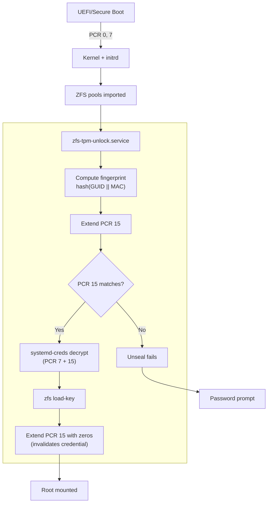

当你配置 TPM2 自动解锁磁盘时，想必你期望的是：即使攻击者拿到了你的机器，数据依然是安全的。但如果我告诉你，很多常见的配置方案其实不到 10 分钟就能被绕过——攻击者只需要一把螺丝刀和一个 U 盘？

这篇文章讲的是如何为 NixOS 设计一套基于 TPM2 的 ZFS 解锁方案。这套方案能够防御三种不同的攻击手段，而这些攻击恰恰是 Clevis 和基础 systemd-cryptenroll 配置的软肋。

## TPM 平台配置寄存器入门

在深入漏洞细节之前，先来了解一下 TPM 是怎么保护密钥的。

可信平台模块（TPM）是一块专用安全芯片，它可以存储密钥，并且只在满足特定条件时才释放。其中的核心机制是**平台配置寄存器（PCR）**——一组 24 个特殊寄存器，用于记录系统启动过程中的各项度量值。

### PCR 的工作原理

PCR 并不是直接存储数值，而是采用单向扩展操作：

```
新PCR值 = hash(旧PCR值 || 新数据)
```

这意味着：
- 每个 PCR 初始值为零（PCR 17-22 初始值为全 0xFF）
- 每次度量都会*扩展*寄存器，将新数据与旧值混合
- 扩展操作不可逆——哈希是单向的
- 最终值代表了*整个度量链*的结果

### PCR 的分配

[Linux TPM PCR Registry](https://uapi-group.org/specifications/specs/linux_tpm_pcr_registry/) 定义了各 PCR 的标准用途：

| PCR | 名称 | 度量内容 |
|-----|------|---------|
| 0 | platform-code | 核心固件（UEFI）|
| 2 | external-code | 扩展 ROM、外部固件 |
| 7 | secure-boot-policy | Secure Boot 状态、已注册的证书 |
| 9 | kernel-initrd | 内核和 initrd 镜像（使用 shim 时）|
| 15 | system-identity | 系统身份标识——*后面会详细讲* |

> **注意**：上表只列出了几个相关的 PCR。完整规范定义了全部 24 个 PCR，详见完整文档。

当你将密钥封装（seal）到 TPM 时，需要指定哪些 PCR 必须匹配。如果攻击者修改了 bootloader，PCR 7 就会变化；如果他们替换了内核，PCR 9 就会变化。这时 TPM 会拒绝解封磁盘密钥。

听起来很安全是吧？可惜，还是有漏洞。

## 三大漏洞

### 1. TPM 总线嗅探（CVE-2026-0714）

**问题所在**：很多 TPM 通过未加密的 SPI 或 I2C 总线与 CPU 通信。有物理接触权限的攻击者可以窃听这条总线，截获传输中的密钥。

这在 [CVE-2026-0714](https://www.cyloq.se/en/research/cve-2026-0714-tpm-sniffing-luks-keys-on-an-embedded-device) 中得到了充分验证：研究人员通过被动嗅探 Moxa 工业计算机的 TPM SPI 总线，在启动过程中成功提取了磁盘加密密钥。`TPM2_NV_Read` 命令直接返回了明文解密密钥——尽管 TPM 正确执行了 PCR 策略检查。

**为什么 Clevis 存在漏洞**：Clevis 默认不使用 TPM 加密会话。当它获取封装的密钥时，通信在总线上以明文传输。攻击者只需将逻辑分析仪连接到 TPM，就能直接捕获密钥。

**解决方案**：使用 TPM 加密会话。TPM2 规范支持经过认证和加密的会话，可以防止总线级别的窃听。

### 2. 根卷混淆攻击

**问题所在**：即使正确绑定了 PCR，大多数方案在执行来自加密卷的代码之前，并没有验证该加密卷的*身份*。

这种精妙的攻击在 [oddlama 的博客文章](https://oddlama.org/blog/bypassing-disk-encryption-with-tpm2-unlock/)中有详细描述。攻击流程如下：

1. 攻击者从 Live USB 启动，备份你加密分区的头部
2. 创建一个新的加密分区，使用*相同的 UUID*，但密码由攻击者控制
3. 在里面放一个精简的 Linux rootfs，包含恶意的 `/sbin/init`
4. 正常重启机器
5. TPM 解锁失败（分区不对），initrd 回退到密码提示
6. 攻击者输入自己的密码——initrd 挂载了假的根分区
7. 恶意 init 运行，此时 TPM 仍处于有效状态
8. 攻击者的代码向 TPM 请求*真正的*解密密钥——拿到了！

根本问题在于：启动链中没有任何环节验证加密卷是否*合法*，就把 TPM 的使用权交出去了。initrd 检查了 bootloader 没被修改（通过 PCR 7），但没检查加密数据是否来自正确的来源。

**为什么仅有 PCR 7 还不够**：PCR 7 度量的是 Secure Boot 状态和证书——它证明的是*代码*的真实性。但它对*数据*（你的加密卷）一无所知。攻击者的假卷不会改变任何启动时的 PCR。

**解决方案**：在解封之前，用每个加密卷的指纹扩展 PCR 15。这样就把 TPM 密钥绑定到了特定的卷，而不仅仅是启动代码。

### 3. 解锁后重放攻击

**问题所在**：磁盘解锁后，TPM 凭据仍然有效。如果攻击者获得了 root 权限，就能重新使用这些凭据。

考虑这样一个场景：
1. 系统正常启动，磁盘通过 TPM 解锁
2. 攻击者利用某个漏洞获得 root 权限
3. 凭据文件（`.cred`）存储在磁盘上——root 可读
4. 攻击者使用 TPM 解密凭据文件
5. 于是他们拿到了你的磁盘加密密码

虽然实际的密钥确实存在于内核内存的某个地方，但现代 Linux 内核有大量保护机制，使得直接提取内存变得很困难：

- **KASLR**（内核地址空间布局随机化）将内核代码和数据的位置随机化
- **KPTI**（内核页表隔离）分离内核和用户空间的页表
- **CONFIG_HARDENED_USERCOPY** 阻止将内核对象复制到用户空间
- **/dev/mem 和 /dev/kmem 限制**阻止直接访问物理内存
- **lockdown 模式**（启用时）进一步限制内核自省

相比之下，解密凭据文件就*简单多了*。

**解决方案**：成功解锁后，用固定值扩展 PCR 15。这会使凭据失效——即使攻击者获得 root 权限，TPM 也会拒绝解封，因为 PCR 15 已经不再匹配注册时的状态。

## 具体实现

本文涉及的 NixOS 系统使用 ZFS 原生加密而非 LUKS。这个选择有其优点——ZFS 加密与快照、复制和写时复制模型完美集成——但也意味着不能直接使用那些为 LUKS 设计的现有工具。

### 挑战：ZFS + 加密会话

需求是：
- TPM 加密会话（防御总线嗅探）
- 使用预计算值的自定义 PCR 绑定（防御卷混淆）
- 解锁后 PCR 扩展（防御重放攻击）

`systemd-cryptenroll` 提供了加密会话，解决了总线嗅探问题，但它只支持 LUKS 卷——不支持 ZFS 原生加密。

`systemd-creds` 共享相同的 TPM 基础设施（包括加密会话！），但有一个致命限制：它[无法针对预期的 PCR 值进行封装](https://github.com/systemd/systemd/issues/38763)——只能针对当前值。这意味着你必须在想要封装的 PCR 状态下启动才能进行注册，预注册就成了不可能。

### mkcreds 登场

这个限制催生了 [mkcreds](https://github.com/codgician/mkcreds)——一个 Rust 工具（Claude 氛围编程的产物），它能创建与 systemd-creds 兼容的凭据，关键是多了一个功能：**支持预期 PCR 值**。

```bash
# 使用预期的 PCR 15 值封装（预先计算）
echo "secret" | mkcreds --tpm2-pcrs="7+15:sha256=<expected-hex>" - mycred.cred

# 之后正常用 systemd-creds 解密
systemd-creds decrypt mycred.cred -
```

这样就能计算出用 ZFS 指纹扩展后 PCR 15 *将会是*什么值，然后针对这个未来状态封装凭据——完全不需要重启。

### ZFS 指纹：证明卷的真实性

为了防御卷混淆，我们需要一个值，它：
1. 能唯一标识每个加密的 ZFS 数据集
2. 在不知道加密密钥的情况下无法伪造

从 ZFS 内部的加密元数据中派生出一个指纹：

```bash
fingerprint = hash(GUID || MAC)
```

其中：
- **GUID**（`DSL_CRYPTO_GUID`）：加密根的唯一标识符
- **MAC**（`DSL_CRYPTO_MAC`）：密钥加密时产生的 AES-GCM 认证标签

MAC 尤为重要。AES-GCM 生成的认证标签取决于明文（密钥）和加密操作本身。攻击者在不知道实际加密密钥的情况下，无法生成有效的 MAC。他们可以创建一个具有相同 GUID 的 ZFS 池，但 MAC 必然不同。

指纹计算使用 `zdb` 直接从 ZFS 元数据中提取这些值：

```bash
# zfs-fingerprint 脚本的简化版本
crypto_obj=$(zdb -ddddd "$pool" "$root_ds" | grep -oP 'crypto_key_obj = \K\d+')
guid=$(zdb -ddddd "$pool" "$crypto_obj" | grep -oP 'DSL_CRYPTO_GUID = \K\d+')
mac=$(zdb -ddddd "$pool" "$crypto_obj" | grep -oP 'DSL_CRYPTO_MAC = \K[0-9a-f]+')
echo -n "${guid}${mac}" | sha256sum | cut -d' ' -f1
```

### 解锁流程

下面是 `zfs-unlock` 模块如何协调安全解锁的：



### NixOS 集成

模块采用声明式配置：

```nix
{
  codgician.system.zfs-unlock = {
    enable = true;
    devices = {
      "zroot" = {
        credentialFile = ./secrets/zroot.cred;
      };
      "zdata/encrypted" = {
        credentialFile = ./secrets/zdata-encrypted.cred;
      };
    };
  };
}
```

`mkzfscreds` 应用负责注册：

```bash
# 计算预期的 PCR 15 并创建凭据
nix run .#mkzfscreds -- zroot > hosts/myhost/zroot.cred

# 输出：
# Creating credential for: zroot (host: myhost)
# Devices: zroot
# Computing expected PCR 15...
#   zroot: a3b2c1d0...
# Expected PCR 15: 7f8e9d0c...
# Enter passphrase for zroot: 
```

这个工具会自动：
1. 读取当前主机的所有配置设备
2. 计算每个设备的指纹（按排序顺序以保证确定性）
3. 模拟 PCR 15 扩展以获取预期值
4. 将凭据封装到 PCR 1、2、7、12、14 和计算出的 15

## 纵深防御

没有任何单一机制是万无一失的。这套方案层层设防：

| 攻击向量 | 防御措施 |
|---------|---------|
| TPM 总线嗅探 | 加密会话（通过 systemd-creds）|
| 卷混淆 | 解锁前指纹 → PCR 15 |
| Root 凭据重放 | 解锁后清零 → PCR 15 |
| Bootloader 篡改 | PCR 7（Secure Boot 策略）|
| 内核/initrd 修改 | PCR 9（使用 shim 时）或 PCR 7（UKI）|

即使某一层被突破，其他层依然有效。攻击者需要同时：
1. 破解总线加密（需要复杂的硬件攻击）
2. 伪造 ZFS 元数据（需要知道加密密钥）
3. 在反重放扩展之前提取密钥（需要在极短的时间窗口内进行内核漏洞利用）

## 结语

基于 TPM 的磁盘解锁听起来很简单——把密钥封装到 PCR，启动时解封。但细节决定成败：

- **加密会话**防止物理总线嗅探
- **卷身份验证**阻止文件系统混淆攻击
- **解锁后失效**限制凭据重放的时间窗口

现有生态存在空白。Clevis 不使用加密会话。大多数 systemd-cryptenroll 教程跳过了 PCR 15 验证。两者都没有很好地支持 ZFS 原生加密。

这套方案——结合 `mkcreds` 创建凭据、ZFS 指纹验证卷身份、以及精心管理的 PCR 15——为使用 ZFS 加密的 NixOS 系统提供了纵深防御。

完整实现在 [serenitea-pot](https://github.com/codgician/serenitea-pot) NixOS 配置中，具体位于 `modules/nixos/system/zfs-unlock/`。[mkcreds](https://github.com/codgician/mkcreds) 工具作为独立的 Nix flake 提供。

---

*本文描述的漏洞影响着许多实际部署的系统。如果你正在使用基于 TPM 的磁盘解锁，请仔细审查你的配置。记住：安全的本质是提高攻击成本，而非追求绝对完美。*
